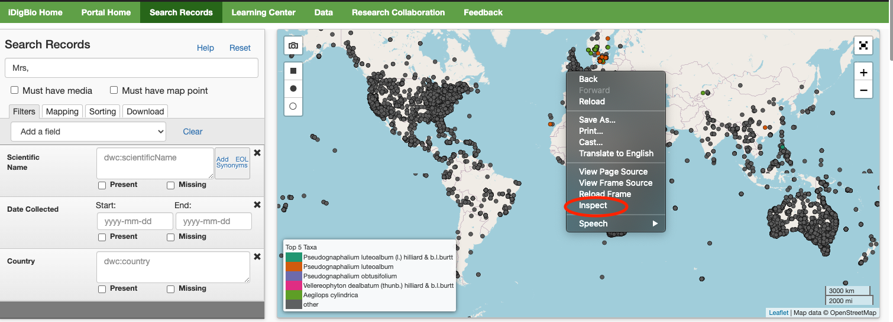
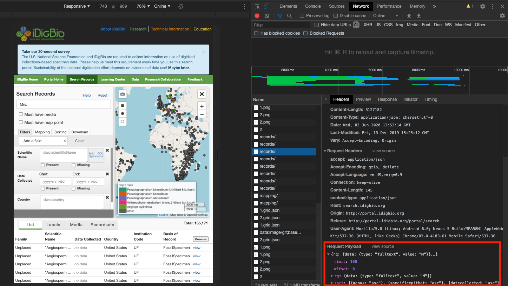

# iDigBio Download API    
iDigBio has four API's: 
  1. [Search API](https://github.com/idigbio/idigbio-search-api/wiki)
    - accessed through the ridigbio R package
    - query under 100,000
  2. [Download API](https://www.idigbio.org/wiki/index.php/IDigBio_Download_API)
    - allows query over 100,000
  3. [Record API](https://www.idigbio.org/wiki/index.php/IDigBio_API#Record_.26_Media_APIs)
    - used for returning prior versions of records
  4. [Media APIs](https://www.idigbio.org/wiki/index.php/IDigBio_API#Record_.26_Media_APIs)
    - used for returning prior versions of media records
    
  
 ## Example of Download API query 
 ### Full text 
 Here I search for Mrs, Ms, and Miss in fulltext. Change the **email@college.edu** to your email address. This can be copy and pasted into your browser
 
 ```
 https://api.idigbio.org/v2/download/?rq={"data":{"type":"fulltext","value":{"Mrs","Ms","Miss"}}}&email={email@college.edu}
 ```
  
  **Note: Searching the two letters of "Ms" will yield way too many records**
  
  
  ## How to format a query to match the portal
  To learn how to format the query, you can *inspect* a query from the web portal and view the *Request Payload*.

 1. 

 
 2. 
 
