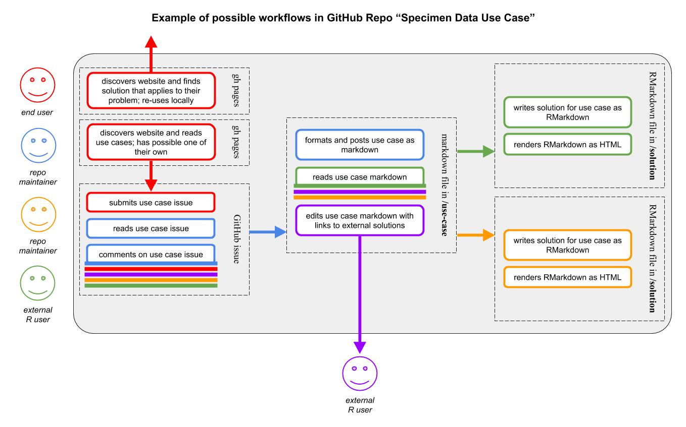

# specimen-data-use-case

This repository serves as a place to **collect specific use cases of biodiversity specimen data**, such as records found on the [iDigBio Portal](https://www.idigbio.org/portal/) or on [GBIF](https://www.gbif.org/). The primary goal of this repository is to document use cases conceptually, and where possible, to link use cases to technical solutions maintained either within or external to this repository.

This repository supports the products of the [iDigBio API User Group (R-based)](https://www.idigbio.org/wiki/index.php/IDigBio_Working_Groups#API_User_Group_.28R-based.29), which focuses on using tools such as the iDigBio API (Application Programming Interface) to work with biodiversity occurrence data in R for the purposes of both collections management, e.g. to review specimen data quality issues, and downstream research, e.g. to facilitate reproducible and reusable methods. Community members of all backgrounds (collections staff, researchers, IT, etc.) and levels of programming experience (including R novice) are encouraged to use this working group as a place to discover and discuss API data access, issues, and solutions, as well as to build a dispersed network of API power users. The working group will maintain relevant code for reuse here in this GitHub repository. If you would like to know more about the working group, please attend one of our informal ["office hour" webinars](https://www.idigbio.org/content/open-office-hours-hosted-api-user-group-r-based).

## How to use this repository
This repository is an information resource as well as an active co-created product. Users whose primary need is information gathering may prefer to view the repository via its [prettified GitHub Pages website](https://biodiversity-specimen-data.github.io/specimen-data-use-case/).

All users are encouraged to contribute to this repository! Anyone with a [GitHub account](https://github.com/join) can create and comment on issues, as well as fork this repo and file a pull request with their edits to files. If you would like permission to push to this repo, please [create an issue](https://github.com/biodiversity-specimen-data/specimen-data-use-case/issues) and tag the _@biodiversity-specimen-data/maintainers_ team.

We anticipate that users will engage with this repository in several key ways, as described in the diagram and text below.

### View biodiversity specimen data use cases and technical solutions

Documented use cases and technical solutions can be found in the [use-case](_use-case) and [solution](_solution) directories. If viewing is your primary purpose, you may prefer to do so via our [prettified GitHub Pages website](https://biodiversity-specimen-data.github.io/specimen-data-use-case/).

### Document use cases

The simplest method of sharing your experience and needs is to [create an issue describing your use case](https://github.com/biodiversity-specimen-data/specimen-data-use-case/issues). For use cases that would benefit from more conversation or refinement, a GitHub issue provides space to do that work collaboratively. Ultimately, issues can get documented in markdown.

If you are comfortable describing your use case in detail, you can skip straight to writing up a new use case in markdown and putting it in the [use-case](_use-case) directory. See the [template](_use-case/_TEMPLATE.md) file for our standard format. It is important to fill out the front matter fields, "title" and "category", at the top of a new use case document because these fields are used to sort use cases on our [prettified GitHub Pages website](https://biodiversity-specimen-data.github.io/specimen-data-use-case/). Your title should be descriptive yet brief, and your category can either be one of the existing categories found on the home page of the GitHub Pages website, or a new one if appropriate.

### Comment on issues

[Issues](https://github.com/biodiversity-specimen-data/specimen-data-use-case/issues) in this repository offer a place for conversation, and we encourage all users to **comment on existing use case issues**. For example, you may find that someone else has already submitted an issue that describes a use case similar to yours and to which you can add thoughts.

Issues in this repository also offer a place to **note problems with any of the technical solutions** provided in the [solution](_solution) directory. Feel free to create a new issue if need be.

This repository is a place for learning, and users of all levels should feel welcome to post an issue. Responding to an issue should involve thoughtfully answering the question posed and, where appropriate, updating files to reflect the answer in context so that future users don't need to sift through closed issues or re-ask the same question.

### Document technical solutions for a use case

We welcome technical solutions for any use cases described in this repository. You are welcome to provide solutions within this repository (pull request or ask for permissions), or if you prefer to maintain work in your own repository you can link your repo to the appropriate markdown in the [use-case](_use-case) directory. Please follow these guidelines for documenting technical solutions:
- All solutions should be **based on a use case** as documented in the [use-case](_use-case) directory. If you have code for a solution that does not yet have a use case written, please write up the use case or see below for an option to share other code examples.
- If at all possible, please provide a rendered **HTML version** of your solution for accessibility and easy viewing via our GitHub Pages website. Note that you should keep the HTML file current with the code file, i.e. re-render if you make changes.
- **Naming convention** for files in the [solution](_solution) directory is _[shortname for use case] underscore [primary package/library]_, e.g. "download-media-from-specimens_ridigbio.Rmd" and "download-media-from-specimens_ridigbio.html." The shortname for the solution and the use case files must match exactly. Use lowercase, and hyphens as space separators. If you are adding a solution that would duplicate an existing filename, suffix it with a numeral, e.g. "download-media-from-specimens_ridigbio-2.Rmd." If you do not name your file as described here, it will not automatically be linked to the use case page in our [prettified GitHub Pages website](https://biodiversity-specimen-data.github.io/specimen-data-use-case/).

### Share other code

Although this repository is designed around use cases, we recognize that many people have written code that they would like to be able to share as is. Please use the [Other Code Examples](other-code-examples.md) document to provide links to external code generally related to using biodiversity specimen data.

## Learning resources

Links for learning about coding languages, relevant code packages/libraries, and relevant data aggregator APIs are available in the [Helpful Links](helpful-links.md) document. Please feel free to add to this document, and/or to create additional learning documents as necessary in the top level of this repository. Keep in mind that whenever appropriate, we would prefer to link out than to have copies of information here.
